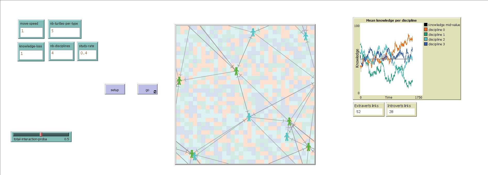

# MAS-Knowledge_Diffusion

## Install Procedure

1. Download the source/Knowledge_diffusion.nlogo file.
2. Open (Netlogo web)[https://www.netlogoweb.org/launch#https://www.netlogoweb.org/assets/modelslib/IABM%20Textbook/chapter%202/Simple%20Economy.nlogo]
3. In (Netlogo web)[https://www.netlogoweb.org/launch#https://www.netlogoweb.org/assets/modelslib/IABM%20Textbook/chapter%202/Simple%20Economy.nlogo], click on Upload a Model:'select file'
4. Chose the downloaded .nlogo file
5. Enjoy !

## What is it ?

The objective of this multi-agent system (MAS) is to simulate the diffusion of agents' knowledge within a closed system based on their affinities with one another. Agents can enhance their knowledge in a finite number of disciplines through practice. Their knowledge can also evolve (increase/decrease) through interactions with other agents, varying in magnitude based on their affinities with each other. Additionally, their knowledge naturally decreases over time when disciplines are not practiced.

This idea comes from my first encounter with MAS during my internship at Inria in Grenoble within the MOEX team on June 2022. At that time, one of the Ph.D. students was working on the design of a MAS and explained to me its general principles. I have remained intrigued by the subject since then, and this project is the perfect opportunity for me to learn how to use it.

## How it works ?

## How to use it ?

## Things to notice

## Things to try

## Extending the model

## Netlogo Features

## Related Models

## Credits and references

* [The construct and application of knowledge diffusion model](https://www.sciencedirect.com/science/article/abs/pii/S0957417403000459) 
* Inria [mOex](https://moex.inria.fr/people/index.html) team 
* [Calicoba](https://www.youtube.com/watch?v=jDddDHp71Ds) method for parameters calibration 
* Netlogo [programming tutorial](https://ccl.northwestern.edu/netlogo/docs/programming.html) 

